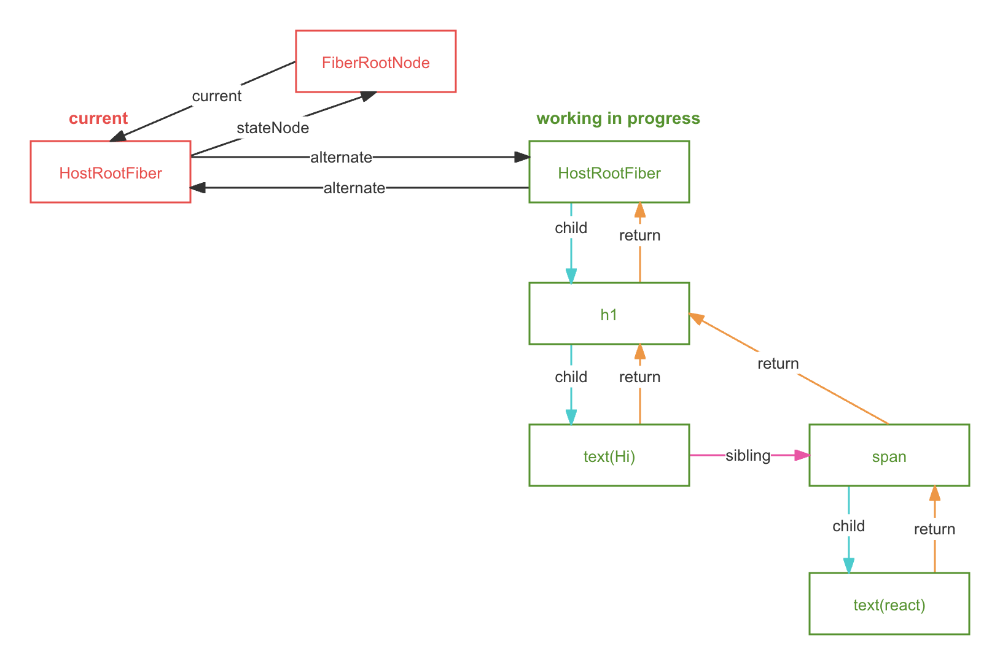

通过fiber架构，使调和的过程可被中断，适时让出CPU的执行权，可以让浏览器及时的响应用户的交互

# fiber的数据结构

- React 使用链表作为fiber的数据结构，每个虚拟节点表示一个fiber
- child 指向第一个子节点
- sibling 指向下一个兄弟节点
- return 指向父节点

## **作用**

- 使用链表数据结构实现react的可中断执行
- 在没有fiber之前react的渲染是不能中断的，必须一气呵成，如果中断就无法继续执行
- fiber是最小执行单元，每次执行完一个执行单元，react就会检查现在还剩多少时间，如果没有时间就让出控制权

# react执行的两个阶段

## 深度优先遍历

1. 从顶点开始遍历
2. 有子fiber遍历子fiber
3. 没有子fiber，则当前节点遍历完成
4. 如果有兄弟节点则遍历兄弟节点
5. 没有兄弟节点，返回父节点表示父节点的遍历完成
6. 没有父节点遍历结束

## render阶段

> 计算副作用，递归实现的深度优先遍历

### beginWork

- “递”的过程
- 当一个节点没有了child节点，则此节点“递”的过程结束，开启此节点的“归”
- 初始化姐阶段： 主要作用是创建fiber树，会处理当前节点的子节点，如果有多个子节点，将子节点用sibling连接，子节点的return指向自己，同时会处理fiber的memoizedState和index等属性
- 更新阶段：dom diff
- 处理自身的副作用添加到flags属性上

### completedWork

- “归”的过程
- 节点“归”的过程完成后，开启sibling的“递”的过程
- “归” 到根节点后遍历完成完成
- 根据当前节点的fiber生成真实DOM实例，放在stateNode属性上
- 将fiber的props属性设置到对应的真实DOM上
- 将子节点的副作用冒泡到subFlags属性上

### 问答环节加深理解

问：什么情况下归的过程会被打断

答：当前完成的节点又sibling的时候会打断归的过程，开启sibling节点“递”的过程，如果“归”的过程中的节点都没有sibling则会一直“归”到根节点结束本次循环

问：一个工作单元完成的节点有哪些

答：当遍历到child或sibling节点会结束本次循环，结束本次工作单元，拿着新节点判断是否有剩余的执行时间，决定是否开启下一个工作单元，开始新节点的工作单元

## commit阶段

> 将fiber渲染为对应的真实DOM
